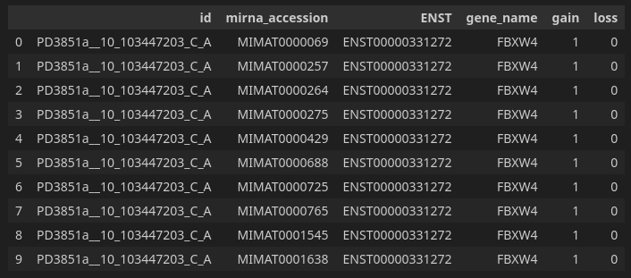
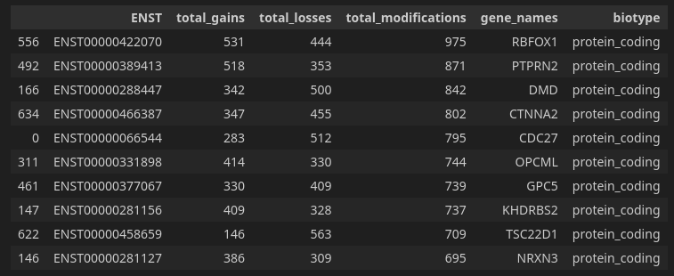
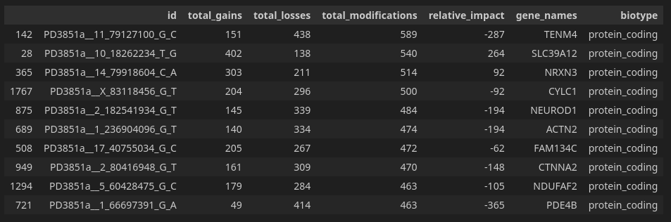
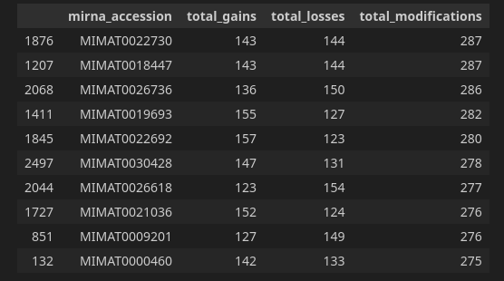

# Case Study for HIBIT23

This is the detailed document of case study presented on the poster.

## Data

The data is "PD3851a" sample taken from COSMIC database, which is a collection of breast cancer tumor mutations, published in Nik-Zainal et al. (2012).

https://cancer.sanger.ac.uk/cosmic/sample/overview?id=1230731

## Methodology

### Importing Data

The vcf dataset is processed by mirscribe pipeline, and results are imported into [processing pipeline](../scripts/truba_results_pipeline/).

Figure 1 below shows the top 10 entries of processed mutations. Each row represents the mutation's effect on a singular miRNA. The "id" column represents the mutation ID, which is encoded in the name_chr_position_ref_alt scheme. The "mirna_accession" column represents the accession of the miRNA that's affected. The "ENST" column contains the transcript ID of the mutation's target. The "gene_name" column contains the name of the aforementioned transcript ID. The "gain" column indicates whether the mutation enabled miRNA binding to that transcript, while the "loss" column indicates the opposite, i.e., whether the mutation resulted in the loss of miRNA binding to that transcript.

*Figure 1: Sample rows from processed analysis data*

### mRNA Trends

The primary objective is to group mutations based on their association with mRNA identifiers ("ENST") and count how many gains and losses that transcript had suffered.

	mRNA_trends = df.groupby("ENST").agg(
	    total_gains=pd.NamedAgg(column="gain", aggfunc="sum"),
	    total_losses=pd.NamedAgg(column="loss", aggfunc="sum"),
	    total_modifications=pd.NamedAgg(column="id", aggfunc="count")
	).reset_index().sort_values("total_modifications", ascending=False)

After aggregating mutation details, gene names and biotypes are incorporated into the dataframe. Subsequently, the dataframe is filtered to include only "protein_coding" biotypes, as the VCF contains mutations that may fall within intergenic regions, including pseudogenes and antisense regions.

	gene_names = dict(zip(df["ENST"], df["gene_name"]))
	mRNA_trends["gene_names"] = mRNA_trends["ENST"].apply(
	    lambda x: gene_names.get(x, None)
	)
	mRNA_trends["biotype"] = mRNA_trends["gene_names"].apply(lambda x: g37.genes_by_name(x)[0].biotype if x is not None else None)
	
	mRNA_trends[mRNA_trends.biotype == "protein_coding"].head(10)

The top 10 affected transcript ids are shown in Figure 2 below.

*Figure 2: Top 10 most affected protein coding transcripts and their details*

Out of 10 most affected transcripts found in Figure 2 above, 9 are linked to cancer. Table 1 below shows the details and references for the mentioned cancer link.

*Table 1: Top 10 most affected protein coding transcripts and their links with different cancer types*

| Gene Name | Cancer link? | Details                                | Reference                      |
| --------- | ------------ | -------------------------------------- | ------------------------------ |
| RBFOX1    | Yes          | Regulates BBB, downregulated in cancer | Shen et al. (2020)             |
| PTPRN2    | Yes          | Overexpressed in cancer                | Sorokin et al. (2015)          |
| DMD       | Yes          | Tumor suppressor                       | Wang et al. (2014)             |
| CTNNA2    | Yes          | Tumor suppressor                       | Fanjul-Fernández et al. (2013) |
| CDC27     | Yes          | Regulates cell division                | Qiu et al. (2016)              |
| OPCML     | Yes          | Tumor suppressor                       | McKie et al. (2012)            |
| GPC5      | Yes          | Tumor suppressor                       | Yuan et al. (2016)             |
| KHDRBS2   | -            |                                        |                                |
| TSC22D1   | Yes          | Tumor suppressor                       | Cho et al. (2017)              |
| NRXN3     | Yes          | Regulated by oncogene miRNA miR-431    | Liu et al. (2021)              |

### Mutation Trends

The primary goal of this section is to group data by unique mutations, count the gains and losses associated with each mutation, and derive biological insights.

	mutation_trends = (df
                   .groupby("id")
                   .agg(
                       total_gains=pd.NamedAgg(column="gain", aggfunc="sum"),
                       total_losses=pd.NamedAgg(column="loss", aggfunc="sum"),
                       total_modifications=pd.NamedAgg(
                           column="id", aggfunc="count")
                   )
                   .reset_index()
                   .sort_values("total_modifications", ascending=False))

	mutation_trends["relative_impact"] = mutation_trends["total_gains"] - \
	    mutation_trends["total_losses"]
	
	gene_names_with_id = dict(zip(df["id"], df["gene_name"]))
	
	mutation_trends["gene_names"] = mutation_trends["id"].apply(
	    lambda x: gene_names_with_id.get(x, None)
	)
	
	mutation_trends["biotype"] = mutation_trends["gene_names"].apply(
	    lambda x: g37.genes_by_name(x)[0].biotype if x is not None else None)
	
	
	mutation_trends[mutation_trends.biotype == "protein_coding"].head(10)

The code above groups the dataframe by IDs and aggregates the total amounts of gains and losses. Additionally, it provides two additional columns: one named "total_modifications," which represents the sum of gains and losses, and the other named "relative_impact," calculated as gains minus losses. The "relative_impact" column serves the purpose of determining whether a mutation predominantly favors gains, losses, or is close to neutral. Subsequently, gene names and biotypes are added, and the data is filtered to include only mutations associated with protein-coding biotypes.

Figure 3 below shows the top 10 results of mutation trends dataframe.

*Figure 3: Top 10 impactful mutations and their details*

Out of the genes that harbor the top 10 impactful mutations, 8 are associated with various types of cancer. One of these genes, FAM134C, is not directly linked to cancer, but its homolog, FAM134B, is associated with cancer. Additionally, one result currently lacks any known links to cancer. Table 2 below shows the details of mentioned genes and their references.

*Table 2: Genes that harboring top 10 most impactful mutations, and their links with different cancer types*

| Gene Name | Cancer Link? | Details                                     | Reference                      |
| --------- | ------------ | ------------------------------------------- | ------------------------------ |
| TENM4     | Yes          | Impaired expression in tumors               | Peppino et al. (2022)          |
| SLC39A12  | Yes          | Altered expression in tumors                | Davis et al. (2021)            |
| NRXN3     | Yes          | Regulated by oncogene miRNA miR-431         | Liu et al. (2021)              |
| CYLC1     | -            |                                             |                                |
| NEUROD1   | Yes          | Oncogene                                    | Li et al. (2021)               |
| ACTN2     | Yes          | Enhances metastatic capabilities            | Wang et al. (2023)             |
| FAM134C   | Partial      | Its homolog FAM134B is linked to cancer     | Chipurupalli et al. (2022)     |
| CTNNA2    | Yes          | Tumor suppressor                            | Fanjul-Fernández et al. (2013) |
| NDUFAF2   | Yes          | Prognostic biomarker                        | Zou et al. (2023)              |
| PDE4B     | Yes          | Altered expression in different tumor types | Huang et al. (2021)            |

### miRNA Trends

The primary goal of this section is to group data by unique miRNAs, count the gains and losses associated with each miRNA, and derive biological insights if possible.

	mirna_trends = df.groupby("mirna_accession").agg(

			total_gains=pd.NamedAgg(column="gain", aggfunc="sum"),
			
			total_losses=pd.NamedAgg(column="loss", aggfunc="sum"),
			
			total_modifications=pd.NamedAgg(column="id", aggfunc="count")
		
		).reset_index().sort_values("total_modifications", ascending=False)

Just like the previous examples, the code above groups the dataframe by unique miRNA IDs to present results in an understandable way.

*Figure 4: Top 10 most affected miRNAs*

Among the top 10 most impacted miRNAs, 8 are found to be linked with different types of cancer. The detailed breakdown of miRNAs and their links are shown in Table 3 below.

*Table 3: Top 10 most impacted miRNAs and their links with different cancer types*

| miRNA Identifier | Cancer Link? | Details                                                    | Reference           |
| ---------------- | ------------ | ---------------------------------------------------------- | ------------------- |
| MIMAT0022730     | Yes          | Tumor suppressor                                           | Shi et al. (2015)   |
| MIMAT0018447     | Partial      | miRNA family miR-548 linked                                | Liang et al. (2012) |
| MIMAT0026736     | Yes          | Targets UBE2C, downregulated in cancer                     | Jin et al. (2019)   |
| MIMAT0019693     | Yes          | Inhibits cancer cell proliferation, migration and invasion | Tang et al. (2020)  |
| MIMAT0022692     | Yes          | Altered expression in different types of cancer            | LIU et al. (2013)   |
| MIMAT0030428     | -            |                                                            |                     |
| MIMAT0026618     | Yes          | Downregulated in GC                                        | Wang et al. (2022)  |
| MIMAT0021036     | -            |                                                            |                     |
| MIMAT0009201     | Yes          | Tumor suppressor                                           | Rawat et al. (2020) |
| MIMAT0000460     | Yes          | Promotes proliferation and migration of PDAC cells         | Chi et al. (2022)                    |

## References

Chi, B., Zheng, Y., Xie, F., Fu, W., Wang, X., Gu, J., Yang, J., Yin, J., Cai, L., Tang, P., Li, J., Guo, S., & Wang, H. (2022). Increased expression of miR-194-5p through the circPVRL3/miR-194-5p/SOCS2 axis promotes proliferation and metastasis in pancreatic ductal adenocarcinoma by activating the PI3K/AKT signaling pathway. _Cancer Cell International_, _22_(1). https://doi.org/10.1186/s12935-022-02835-0

Chipurupalli, S., Ganesan, R., Martini, G., Mele, L., Reggio, A., Esposito, M., Kannan, E., Namasivayam, V., Grumati, P., Desiderio, V., & Robinson, N. (2022). Cancer cells adapt FAM134B/BiP mediated ER-phagy to survive hypoxic stress. _Cell Death & Disease_, _13_(4), 1–13. https://doi.org/10.1038/s41419-022-04813-w

Cho, M.-J., Lee, J.-Y., Shin, M.-G., Kim, H.-J., Choi, Y.-J., Rho, S. B., Kim, B.-R., Jang, I. S., & Lee, S.-H. (2017). TSC-22 inhibits CSF-1R function and induces apoptosis in cervical cancer. _Oncotarget_, _8_(58), 97990–98003. https://doi.org/10.18632/oncotarget.20296

Davis, D. N., Strong, M. D., Chambers, E., Hart, M. D., Bettaieb, A., Clarke, S. L., Smith, B. J., Stoecker, B. J., Lucas, E. A., Lin, D., & Chowanadisai, W. (2021). A role for zinc transporter gene SLC39A12 in the nervous system and beyond. _Gene_, _799_, 145824. https://doi.org/10.1016/j.gene.2021.145824

Fanjul-Fernández, M., Quesada, V., Cabanillas, R., Cadiñanos, J., Fontanil, T., Obaya, Á., Ramsay, A. J., Llorente, J. L., Astudillo, A., Cal, S., & López-Otín, C. (2013). Cell–cell adhesion genes CTNNA2 and CTNNA3 are tumour suppressors frequently mutated in laryngeal carcinomas. _Nature Communications_, _4_(1). https://doi.org/10.1038/ncomms3531

Huang, Z., Liu, J., Yang, J., Yan, Y., Yang, C., He, X., Huang, R., Tan, M., Wu, D., Yan, J., & Shen, B. (2021). PDE4B Induces Epithelial-to-Mesenchymal Transition in Bladder Cancer Cells and Is Transcriptionally Suppressed by CBX7. _Frontiers in Cell and Developmental Biology_, _9_. https://doi.org/10.3389/fcell.2021.783050

Jin, D., Guo, J., Wu, Y., Du, J., Wang, X., An, J., Hu, B., Kong, L.-Q., Di, W., & Wang, W. (2019). UBE2C, Directly Targeted by miR-548e-5p, Increases the Cellular Growth and Invasive Abilities of Cancer Cells Interacting with the EMT Marker Protein Zinc Finger E-box Binding Homeobox 1/2 in NSCLC. _Theranostics_, _9_(7), 2036–2055. https://doi.org/10.7150/thno.32738

Li, Z., He, Y., Li, Y., Li, J., Zhao, H., Song, G., Miyagishi, M., Wu, S., & Kasim, V. (2021). NeuroD1 promotes tumor cell proliferation and tumorigenesis by directly activating the pentose phosphate pathway in colorectal carcinoma. _Oncogene_, _40_(50), 6736–6747. https://doi.org/10.1038/s41388-021-02063-2

Liang, T., Guo, L., & Liu, C. (2012). Genome-Wide Analysis of mir-548 Gene Family Reveals Evolutionary and Functional Implications. _Journal of Biomedicine and Biotechnology_, _2012_, 679563. https://doi.org/10.1155/2012/679563

LIU, J., SHI, W., WU, C., JU, J., & JIANG, J. (2013). miR-181b as a key regulator of the oncogenic process and its clinical implications in cancer (Review). _Biomedical Reports_, _2_(1), 7–11. https://doi.org/10.3892/br.2013.199

Liu, L., Zhang, P., Dong, X., Li, H., Li, S., Cheng, S., Yuan, J., Yang, X., Qian, Z., & Dong, J. (2021). Circ_0001367 inhibits glioma proliferation, migration and invasion by sponging miR-431 and thus regulating NRXN3. _Cell Death and Disease_, _12_(6). https://doi.org/10.1038/s41419-021-03834-1

McKie, A. B., Vaughan, S., Zanini, E., Okon, I. S., Louis, L., de Sousa, C., Greene, M. I., Wang, Q., Agarwal, R., Shaposhnikov, D., Wong, J. L. C., Gungor, H., Janczar, S., El-Bahrawy, M., Lam, E. W.-F. ., Chayen, N. E., & Gabra, H. (2012). The OPCML tumor suppressor functions as a cell surface repressor-adaptor, negatively regulating receptor tyrosine kinases in epithelial ovarian cancer. _Cancer Discovery_, _2_(2), 156–171. https://doi.org/10.1158/2159-8290.CD-11-0256

Nik-Zainal, S., Alexandrov, Ludmil B., Wedge, David C., Van Loo, P., Greenman, Christopher D., Raine, K., Jones, D., Hinton, J., Marshall, J., Stebbings, Lucy A., Menzies, A., Martin, S., Leung, K., Chen, L., Leroy, C., Ramakrishna, M., Rance, R., Lau, K., Mudie, Laura J., & Varela, I. (2012). Mutational Processes Molding the Genomes of 21 Breast Cancers. _Cell_, _149_(5), 979–993. https://doi.org/10.1016/j.cell.2012.04.024

Peppino, G., Riccardo, F., Arigoni, M., Bolli, E., Barutello, G., Cavallo, F., & Quaglino, E. (2022). Role and Involvement of TENM4 and miR-708 in Breast Cancer Development and Therapy. _Cells_, _11_(1), 172. https://doi.org/10.3390/cells11010172

Qiu, L., Wu, J., Pan, C., Tan, X., Lin, J., Liu, R., Chen, S., Geng, R., & Huang, W. (2016). Downregulation of CDC27 inhibits the proliferation of colorectal cancer cells via the accumulation of p21Cip1/Waf1. _Cell Death & Disease_, _7_(1), e2074–e2074. https://doi.org/10.1038/cddis.2015.402

Rawat, V. P. S., Götze, M., Rasalkar, A., Vegi, N. M., Ihme, S., Thoene, S., Pastore, A., Bararia, D., Döhner, H., Döhner, K., Feuring-Buske, M., Quintanilla-Fend, L., & Buske, C. (2020). The microRNA miR-196b acts as a tumor suppressor in Cdx2-driven acute myeloid leukemia. _Haematologica_, _105_(6), e285–e289. https://doi.org/10.3324/haematol.2019.223297

Shen, S., Yang, C., Liu, X., Zheng, J., Liu, Y., Liu, L., Ma, J., Ma, T., An, P., Lin, Y., Cai, H., Wang, D., Li, Z., Zhao, L., & Xue, Y. (2020). RBFOX1 Regulates the Permeability of the Blood-Tumor Barrier via the LINC00673/MAFF Pathway. _Molecular Therapy - Oncolytics_, _17_, 138–152. https://doi.org/10.1016/j.omto.2020.03.014

Shi, Y., Qiu, M., Wu, Y., & Hai, L. (2015). MiR-548-3p functions as an anti-oncogenic regulator in breast cancer. _Biomedicine & Pharmacotherapy_, _75_, 111–116. https://doi.org/10.1016/j.biopha.2015.07.027

Sorokin, A. V., Nair, B. C., Wei, Y., Aziz, K. E., Evdokimova, V., Hung, M., & Chen, J. (2015). Aberrant Expression of proPTPRN2 in Cancer Cells Confers Resistance to Apoptosis. _Cancer Research_, _75_(9), 1846–1858. https://doi.org/10.1158/0008-5472.can-14-2718

Tang, J., Hu, Y., Zhang, C., & Gong, C. (2020). miR‑4636 inhibits tumor cell proliferation, migration and invasion, and serves as a candidate clinical biomarker for gastric cancer. _Oncology Letters_, _21_(1), 1–1. https://doi.org/10.3892/ol.2020.12294

Wang, C., Xie, B., Yin, S., Jie, C., Huang, J., Jin, L., Du, G., Zhai, X., Zhang, R., Li, S., Cao, T., Yu, H., Fan, X., Yang, Z., Peng, J., Xiao, J., & Lian, L. (2023). Induction of filopodia formation by α-Actinin-2 via RelA with a feedforward activation loop promoting overt bone marrow metastasis of gastric cancer. _Journal of Translational Medicine_, _21_(1). https://doi.org/10.1186/s12967-023-04156-w

Wang, Y., Li, M., Zeng, J., Yang, Y., Li, Z., Hu, S., Yang, F., Wang, N., Wang, W., & Tie, J. (2022). MiR-585-5p impedes gastric cancer proliferation and metastasis by orchestrating the interactions among CREB1, MAPK1 and MITF. _Frontiers in Immunology_, _13_. https://doi.org/10.3389/fimmu.2022.1008195

Wang, Y., Marino-Enriquez, A., Bennett, R. R., Zhu, M., Shen, Y., Eilers, G., Lee, J.-C., Henze, J., Fletcher, B. S., Gu, Z., Fox, E. A., Antonescu, C. R., Fletcher, C. D. M., Guo, X., Raut, C. P., Demetri, G. D., van de Rijn, M., Ordog, T., Kunkel, L. M., & Fletcher, J. A. (2014). Dystrophin is a tumor suppressor in human cancers with myogenic programs. _Nature Genetics_, _46_(6), 601–606. https://doi.org/10.1038/ng.2974

Yuan, S., Yu, Z., Liu, Q., Zhang, M., Xiang, Y., Wu, N., Wu, L., Hu, Z., Xu, B., Cai, T., Ma, X., Zhang, Y., Liao, C., Wang, L., Yang, P., Bai, L., & Li, Y. (2016). GPC5, a novel epigenetically silenced tumor suppressor, inhibits tumor growth by suppressing Wnt/β-catenin signaling in lung adenocarcinoma. _Oncogene_, _35_(47), 6120–6131. https://doi.org/10.1038/onc.2016.149

Zou, K., Gao, P., Xu, X., Zhang, W., & Zeng, Z. (2023). Upregulation of NDUFAF2 in Lung Adenocarcinoma Is a Novel Independent Prognostic Biomarker. _Computational and Mathematical Methods in Medicine_, _2023_, 1–20. https://doi.org/10.1155/2023/2912968

‌